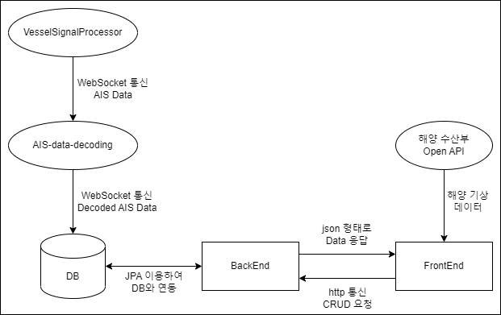

# 💡 Topic

### 부산 연안 선박 위치, 상세 정보 제공 및 위치 예측 서비스

# 📝 Summary

- 부산대학교 개발자 양성과정에서 기업 GC(Global Control)와 연계하여 진행한 웹 프로젝트입니다.
- GC에서 제공한 AIS(선박자동식별시스템)로 실시간으로 부산 연안 선박들의 위치를 표시하고 상세 정보(선박 종류, 선박 이름, 속력, 방향 등)를 제공합니다.
- AIS 신호가 소실(마지막 신호로부터 5분 경과)된 선박의 경우 이전의 데이터들을 기반으로 최대 30분까지 위치를 예측하여 표시합니다.

# ⭐ Key Function

- **실시간**으로 AIS 데이터를 받아와 선박 종류별(화물선, 유조선)로 다른 이미지로 표시
- **필터링(전체, 화물선, 유조선, 신호 소실 선박)** 기능 제공
- 신호 수신된 전체 선박의 **리스트를 제공**하고 리스트에서 해당 선박을 선택하거나 지도 상에서 선박 선택시 **해당 선박과 상세 정보를 표시하는 페이지**로 이동
- 상세 정보 페이지에서 **'상세 경로'** 버튼을 클릭하면 **해당 선박의 이동 경로(초록색)를 표시하고 만약 해당 선박이 신호가 소실된 선박이라면 예측 경로(빨간색)를 표시**
- 해양 수산부 바다누리 해양정보 서비스 Open API를 이용해 **실시간**으로 해운대 해수욕장 해양관측부이에서 관측하는 **최신 관측데이터(관측시간, 풍향, 풍속, 유향, 유속, 파고)를 가져와 표시**

# 🛠️ Tech Stack

`Java` `Spring Framework` `SpringBoot` `React` `Express` `MySQL`

# ⚙️ Development Environment & Architecture

### FrontEnd

- IDE : VScode
- Version : Node.js 16.13.2
- Library : React, react-router-dom, styled-components, (react-)bootstrap, mui, axios, react-window, moment

### BackEnd

- IDE : Intellij
- Version : Java 17, SpringBoot 2.7.8
- Build : Gradle-Groovy
- Dedenpency : Spring Web, Spring Data JPA, Lombok, Spring Boot DevTools, MySQL Driver

### DB

- MySQL 8.0
- ERD : https://www.erdcloud.com/d/z7r569Zbby3icTTSP

### AIS-data-decoding

- IDE : VScode
- Version : Node.js 16.13.2, Express 4.18.2
- Library : mysql, proj4, protobufjs, ws

### VesselSignalProcessor

- GC 제공 AIS 신호 수신 프로그램

### Architecture

# ✋🏻 Part

# ⭕ Learned

# ❌ Problems
