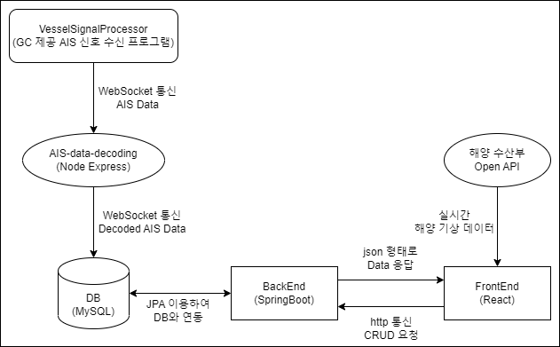

# 💡 Topic

### 부산 연안 선박 위치, 상세 정보 제공 및 위치 예측 서비스

# 📝 Summary

- 부산대학교 개발자 양성과정에서 기업 GC(Global Control)와 연계하여 진행한 웹 프로젝트입니다.
- GC에서 제공한 AIS(선박자동식별시스템)로 실시간으로 부산 연안 선박들의 위치를 표시하고 상세 정보(선박 종류, 선박 이름, 속력, 방향 등)를 제공합니다.
- AIS 신호가 소실(마지막 신호로부터 5분 경과)된 선박의 경우 이전의 데이터들을 기반으로 최대 30분까지 위치를 예측하여 표시합니다.

# ⭐ Key Function

- **실시간**으로 AIS 데이터를 받아와 선박 종류별(화물선, 유조선)로 다른 이미지로 표시
- **필터링(전체, 화물선, 유조선, 신호 소실 선박)** 기능 제공
- 신호 수신된 전체 선박의 **리스트를 제공**하고 리스트에서 해당 선박을 선택하거나 지도 상에서 선박 선택시 **해당 선박과 상세 정보를 표시하는 페이지**로 이동
- 상세 정보 페이지에서 **'상세 경로'** 버튼을 클릭하면 **해당 선박의 이동 경로(초록색)를 표시하고 만약 해당 선박이 신호가 소실된 선박이라면 예측 경로(빨간색)를 표시**
- 해양 수산부 바다누리 해양정보 서비스 Open API를 이용해 **실시간**으로 해운대 해수욕장 해양관측부이에서 관측하는 **최신 관측데이터(관측시간, 풍향, 풍속, 유향, 유속, 파고)를 가져와 표시**

# 🛠️ Tech Stack

`Java` `Spring Framework` `Javascript` `React` `Express` `MySQL`

# ⚙️ Development Environment & Architecture

### FrontEnd

- IDE : VScode
- Version : Node.js 16.13.2
- Library : React, react-router-dom, styled-components, (react-)bootstrap, mui, axios, react-window, moment

### BackEnd

- IDE : Intellij
- Version : Java 17, SpringBoot 2.7.8
- Build : Gradle-Groovy
- Dedenpency : Spring Web, Spring Data JPA, Lombok, Spring Boot DevTools, MySQL Driver

### DB

- MySQL 8.0
- ERD
   
  

### AIS-data-decoding

- IDE : VScode
- Version : Node.js 16.13.2, Express 4.18.2
- Library : mysql, proj4, protobufjs, ws

### VesselSignalProcessor

- GC 제공 AIS 신호 수신 프로그램

### Architecture

# ✋🏻 Part
- 개인 프로젝트

# ⭕ Learned

- **React**와 다양한 **React 라이브러리**들을 프로젝트에 적용해볼 수 있었음
- **KakaoMap Open API**를 사용하면서 공식 문서를 찾아보며 프로젝트에 맞게 적용해볼 수 있었음
- **JPA의 Query Methods** 뿐만 아니라 **Native Query**를 사용해 필요한 데이터들을 가져올 수 있었음
- **Express framework**의 기본 사용법을 알게 되었음
- **WebSocket**을 공부하고 사용해봄으로써 **개념, 사용이유, 작동원리, 문제점**을 알 수 있었음
- **React**와 **Spring** 프로젝트를 연동하면서 발생한 **CORS 에러**를 **Proxy** 설정을 통해 해결할 수 있었음

# 🔥 Improvement
- FrontEnd 구조상 페이지마다 사용하는 데이터가 달라서 페이지마다 새롭게 데이터를 요청해서 사용하는데 **Redux** 같은 라이브러리를 사용해서 데이터를 한번에 관리하는 방향으로 개선해볼 필요가 있음
- setInterval 함수를 이용해서 10초마다 서버에 요청을 보내도록 구현되어있는데 지속적인 요청의 경우 **WebSocket 통신**을 이용하고 신호가 소실된 선박이라고 판단하는 **비지니스 로직을 백엔드에서 처리**하는 것으로 수정할 필요가 있음
- 전체 선박들의 최신 AIS 데이터를 가져올 때마다 AIS 테이블의 모든 row를 검색해야하는 비효율적인 방법을 사용하고 있기 때문에 **Index 설정**을 통해서 **검색 속도를 향상**시킬 필요가 있음
- 서비스의 확장성을 고려할 때 **대용량 메시지 데이터를 빠르게 처리**할 수 있는 메시징 시스템 **Kafka**에 대해 공부하고 적용해볼 필요가 있음
- Local 환경에서 개발을 할때 프로젝트 구조상 포트를 5개를 사용하게 되는데 이런 프로젝트를 배포하기 위해 **작고, 독립적으로 배포 가능한 각각의 기능을 수행하는 서비스로 구성된 프레임워크**인 **MSA(MicroService Architecture)** 에 대해 공부하고 적용해볼 필요가 있음
